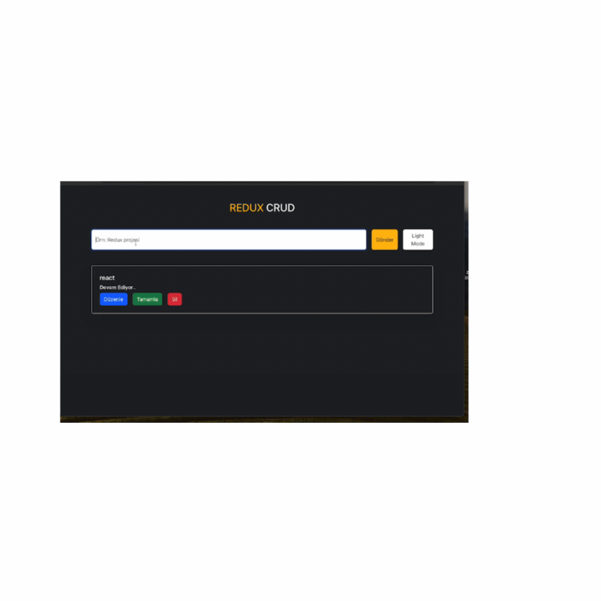

## redux-crud

- 

 State Yönetimi

- State: Uygulamadaki bileşenlerin sahip olduğu bilgi ve özelliklerdir.

- Prop Drilling: Bileşenlerin yukarıdan aşağıya veri taşımasıdır.

- Context: Uygulamadaki state i bütün bileşenler tarafından erişilebilen ve oluşturduğumuz merkezlerden yönettiğimiz state yönetim aracıdır.(redux dan farkı birden fazla olabilir küçük çaplı projelerde kullanılır)

- Redux: Bileşenlerin sahip olduğu ve merkezi olarak tutulması gereken statelerin yönetildiği merkezi state yönetim aracıdır. (store dan yönetilir, orta ve büyük projelerde kullanılır)

## Neden Context yerine Redux ??? 

- Kod tekrarını önler
- Performansı daha iyidir.
- Bileşen içerisindeki karışıklığı azaltır.
- Hata ayıklama daha kolaydır.
- Orta ve büyük ölçekli projelerde state yönetimi daha kolay hale getirir.

## Kütüphaneler

- bootstrap
- json-server
- react-redux
- redux
- uuid

## redux ile ilgili bilinmesi gerekenler

1. Store: uygulamanın bütün bileşenleri tarafından erişilebilen ve yönetilebilen state deposu

2. Reducer: aksiyonlardan aldığı talimata göre store da tutulan  state in  nasıl değişeceğine karar veren fonksiyondur.

3. Action: store da ki state i güncellemek için reducera gönderdiğimiz nesnedir.(emir- haber- talimat)
2 değer alan bir nesne dönderir;
-1. type: zorunludur. actionun görevini tanımlayan bir string değerdir.
-2. payload : opsiyonel, actionun verisidir.

